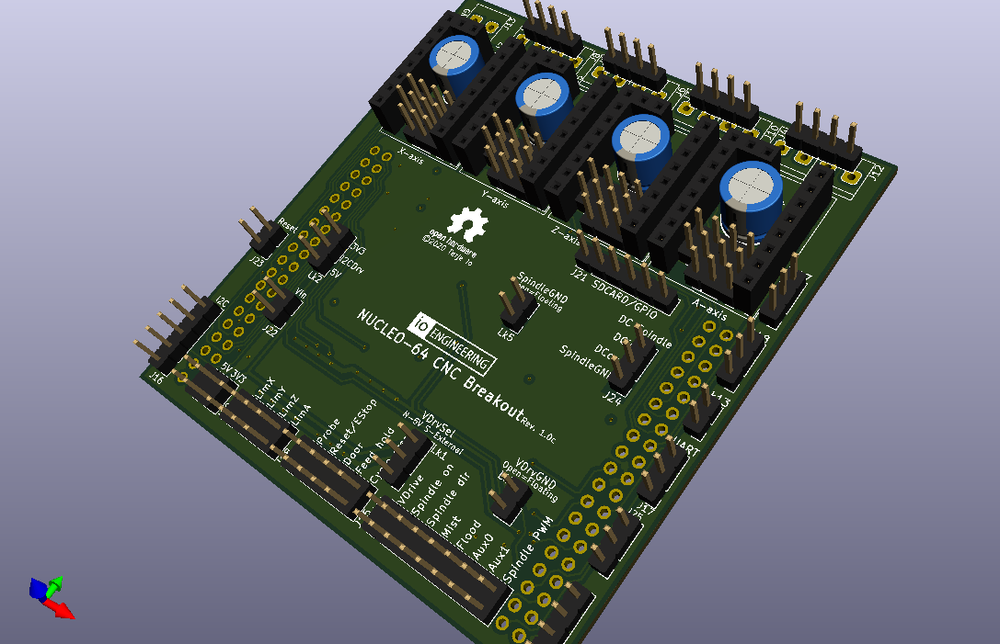
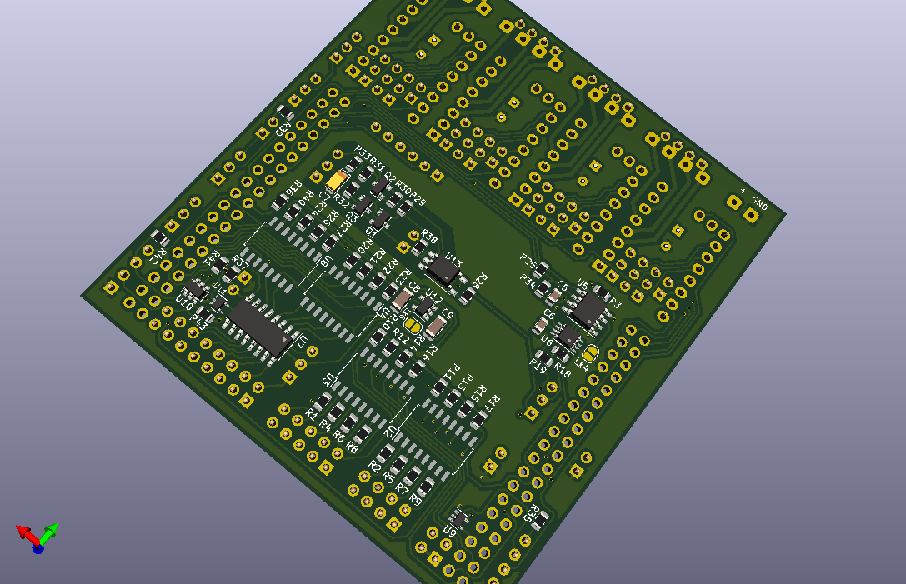

## CNC Breakout board for Nucleo-64 based development boards using ST morpho extension header

[grblHAL driver](https://github.com/grblHAL/STM32F4xx) support for [Nucleo F411RE](https://www.st.com/en/evaluation-tools/nucleo-f411re.html) and [Nucleo F446RE](https://www.st.com/en/evaluation-tools/nucleo-f446re.html) development boards.

**NOTE:** design files are in [KiCad 5](http://www.kicad-pcb.org/) format!

**Features:**

* Four layer board

* 4-axis motor support with separate enable for all axes.

* On-board sockets for Polulu \(A4998 and DRV8825\) or Trinamic \(TMC2130 or TMC5160 - SPI mode, TMC2209 - UART mode\) style motor driver modules.

* Opto-coupled limit and signal inputs (X, Y, Z, A, Probe, Reset/E-Stop, Door, Feed Hold and Cycle Start).

* Opto-coupled signal outputs \(Spindle on, Spindle direction, Flood, Mist, Aux0 and Aux1\).
Outputs are open drain \(ULN2003\) capable of draining 500mA, enough to drive most relays directly.

* Jumper selectable drive voltage for inputs and outputs, either 5V internally supplied or 5-30V externally supplied. 
If externally supplied inputs and outputs can be made galvanically isolated from the controller via jumper settings.

* 5V buffered PWM output for spindle speed control.

* Optional optocoupled DC spindle output, can be made galvanically isolated via jumper setting. External supply voltage limited to rating of filtering capacitor C7 (max. 30V).

* I2C port with jumper selectable drive voltage \(3.3V or 5V\). This is complemented with a 5V tolerant input pin that may be used as an interrupt source, eg. for the strobe signal from a I2C-based keypad.

* Two GPIO ports, with two pins each. One is unbuffered and can be used for serial communincation, eg. for MPG or VFD control. One is input only and has 5V tolerant pins.

* Optional on-board EEPROM/FRAM for persistent storage of settings.

* SPI based SD-card interface. If not in use some or all pins may be used as GPIO or as a generic SPI interface with one chip select line, depending on motor drivers used.

---

I have a number of _bare_ boards available:

* 1.0 \(preliminary version\): 7 pcs. These do not support Trinamic drivers in SPI/UART mode and has a couple of correctable routing errors in the spindle PWM -> spindle DC circuit. Price: shipping at cost.

* 1.0b: 2 pcs. Price: EUR 5/pcs + shipping at cost. These are missing a pullup resistor for the keypad strobe input - this _may_ affect operation of the keypad plugin. Easy to add externally.

These boards are gold plated \(ENIG finish\).

* 1.0c: \(current version\) Not yet available.

I do not plan to offer populated boards as either I have to solder them myself \(will be expensive\) or place an order for ready made boards \(with only SMD components soldered\).  
A redesign is likely required for ready made boards as some of the components may not available from the standard selection offered by e.g. [JLPCB](https://jlcpcb.com/).

It would be great if someone would get populated boards made and offered for sale as I am currently not prepared to do that.

---

2021-08-22
